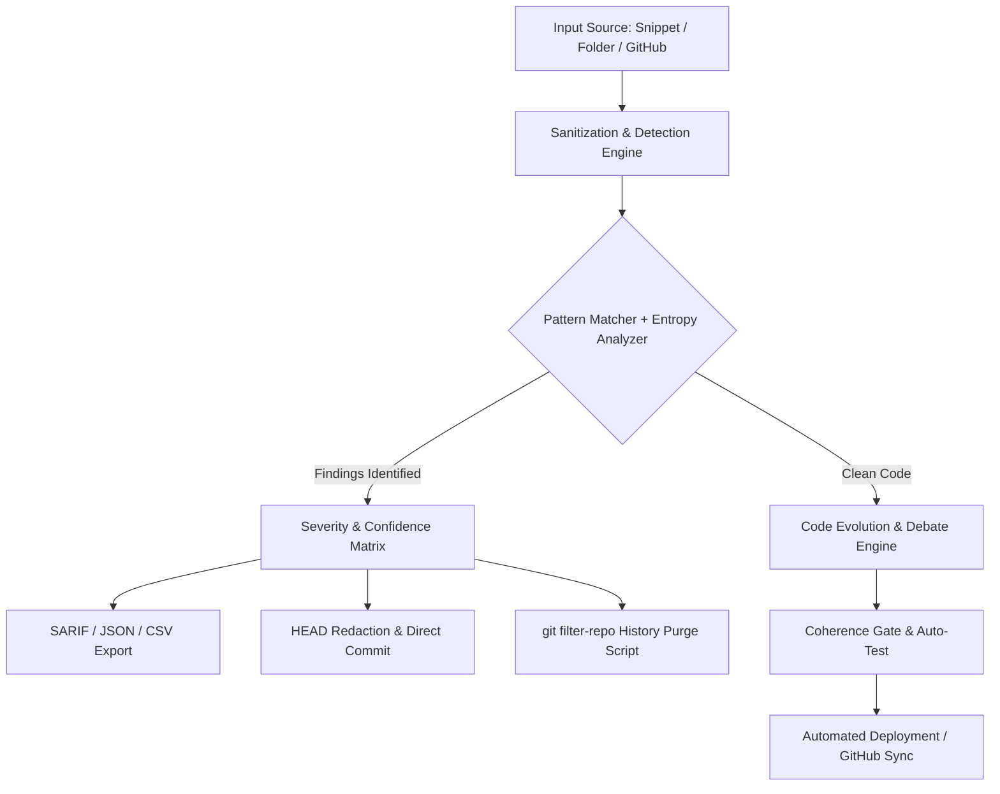

# DARLEK CAAN Cognitive Engine

---

## 🌐 Live Web Application

Access the live platform directly in your browser:
- 👉 **[Open Development Application](https://ais-dev-amubz4v3czr3772fnvrcru-483535245139.asia-southeast1.run.app)**  
- 👉 **[Open Shared Preview Application](https://ais-pre-amubz4v3czr3772fnvrcru-483535245139.asia-southeast1.run.app)**

---

## 💡 Overview

The **DARLEK CAAN Cognitive Engine** is an enterprise-grade security scanner, automated remediation platform, and autonomous code evolution suite designed for GitHub repositories, local file trees, and raw code snippets.

It combines multi-pattern regex matching, Shannon-entropy detection, and Luhn checksum validation with automated Git history purging (`git filter-repo`) and AI-driven multi-model dialectic debate to identify, isolate, and neutralize sensitive data leaks before or after they reach version control.

---

## ✨ Key Capabilities

### 1. 🔍 High-Precision Secret & PII Detection
- **Comprehensive Pattern Library**: Detects over 40+ high-value token formats including OpenAI (`sk-`, `sk-proj-`), Anthropic, Google Gemini, Cohere, Mistral, GitHub PATs & fine-grained tokens, GitLab, AWS, Azure, Stripe, PayPal, Twilio, Slack, Discord, SendGrid, Firebase, MongoDB URIs, and database connection strings.
- **Shannon Entropy Engine**: Heuristic fallback detector identifying high-entropy string literals assigned to sensitive variables (`key`, `token`, `secret`, `password`, `credential`).
- **Validated PII Scanning**: Luhn-validated credit card numbers, IBAN/SWIFT identifiers, IPv4/IPv6 addresses, MAC addresses, emails, phone numbers, and regional tax IDs.
- **Granular Confidence Scoring**: Every finding is categorized as `High`, `Medium`, or `Low` confidence with line numbers, code snippets, and exact offset coordinates.

### 2. 🧯 Surgical Remediation & Full Git History Purge
- **Non-Destructive In-Place Redaction**: Replaces only the matched secret value while preserving variable syntax, comments, and structure (e.g., `API_KEY="<OPENAI_API_KEY_REDACTED>"`).
- **Automated `git filter-repo` Script Generator**: Generates deterministic `replacements.txt` rule sets to purge leaked tokens across all commits in historical Git tree objects without deleting files.
- **Direct GitHub Commit Fix**: Instantly patch HEAD branches with conventional security commit messages (`fix(security): redact exposed API_KEY in <path>`).
- **Confirmation Safety Circuit**: Multi-step confirmation required before destructive rewrite scripts are unlocked.

### 3. ⚡ High-Throughput & Rate-Aware Scanning
- **Concurrent Request Queue**: Parallel file ingestion with concurrency controls.
- **GitHub Rate Limit Awareness**: Actively monitors `X-RateLimit-Remaining` and `X-RateLimit-Reset` to pause and resume automatically.
- **Branch & Path Filtering**: Multi-branch selector with automated binary file detection and configurable file-size caps.

### 4. 📊 Findings Management & Export
- **Multi-Format Export**: Export scan results directly to **SARIF v2.1.0** (compatible with GitHub Advanced Security tabs), structured **JSON**, and **CSV**.
- **Real-Time Session Telemetry**: Filter findings by repository, file path, severity (Critical/High/Medium/Low), and confidence.
- **Integrated CodeMirror Inspector**: Syntax-highlighted diffs and sanitized previews.

### 5. 🤖 Multi-Agent Evolution & Dialectic Debate Chamber
- **Automated Code Evolution**: Propose architectural refactors, safety optimizations, and code cleanups.
- **Dialectic Debate Chamber**: Multi-LLM consensus system analyzing risk coefficients, cognitive friction, and epistemic rulings before applying changes.

---

## 🛠️ Architecture & Workflow

---

## 🚀 Quick Start Guide

### Step 1: Connect GitHub Account
1. Open the [Live Web Application](https://ais-dev-amubz4v3czr3772fnvrcru-483535245139.asia-southeast1.run.app).
2. Enter your **GitHub Personal Access Token** (`repo` scope required for scanning private repositories and pushing commits).
3. Select your target repository and working branch.

### Step 2: Run a Scan
- **GitHub Tab**: Click **Start Scan** to analyze the active repository.
- **Folder Tab**: Drag and drop a folder or `.zip` archive for client-side scanning.
- **Snippet Tab**: Paste raw code, config files, or `.env` templates for instant sanitization.

### Step 3: Review Findings & Remediate
1. Inspect the classified findings list filtered by severity or secret type.
2. Click **Sanitize & Commit** to patch HEAD immediately.
3. For leaked secrets present in previous commits, open the **History Purge Dialog**, type `DELETE` to confirm, and run the generated `git filter-repo` script in your terminal.
4. Download the **SARIF** report to upload findings to your GitHub Security Dashboard.

---

## 📡 API Endpoints Reference

| Endpoint | Method | Description |
| :--- | :--- | :--- |
| `/api/github/scan` | `POST` | Scan GitHub repository trees for secrets and PII |
| `/api/github/user-repos` | `POST` | Retrieve authenticated user repositories |
| `/api/github/branches` | `POST` | Fetch all active branches for a repository |
| `/api/github/write-file` | `POST` | Commit sanitized or refactored files |
| `/api/evolution/debate` | `POST` | Run multi-agent dialectic consensus debate |
| `/api/evolution/auto-test` | `POST` | Execute static and architectural coherence tests |
| `/api/brain` | `POST` | System state synchronization and telemetry |

---

## 🔒 Security & Privacy

- **Client-Side Processing**: Regex matching and snippet sanitization execute locally in browser memory whenever possible.
- **Zero Token Persistence**: GitHub tokens and API keys are stored in secure local session memory and never transmitted to third-party tracking services.
- **Rate-Limit Safe**: Built-in exponential backoff preventing API token suspensions during large repository scans.

---

## 📄 License

Copyright © 2026. All rights reserved.