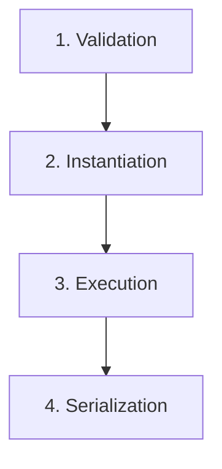

# 🌌 ORCHESTRA EVOLUTION ENGINE [v2.0-SOVEREIGN]

> **EMG Core v49 Neural Code & Documentation Module**  
> *File Path:* `src/app/api/evolution/orchestra/README.md`

---

## 🏗️ Architectural Topology

*   **Sovereign Orchestrator**: High-performance state encapsulation and execution logic controller engineered for deterministic output generation.
*   **Parallel Synchronization**: Concurrent multi-threaded execution engine optimized for rapid multi-perspective synthesis and latent space exploration.
*   **Dialectic Debate**: Sequential, state-persistent reasoning cycles designed for advanced logical conflict resolution and deep-dive verification.

---

## 🔗 Kernel Integration

*   **Infrastructure Layer**: Direct, low-latency interfacing with `lib/llm-provider`, utilizing hyper-resilient multi-model fallback protocols to guarantee maximum uptime.
*   **Agentic Alignment**: Native integration with `sovereign-kernel` agent swarms, enabling autonomous code evolution and recursive self-improvement.

---

## ⚡ Optimized Workflow



1.  **Validation**: Schema-strict verification of incoming evolution parameters to ensure structural integrity.
2.  **Instantiation**: Low-latency allocation of sovereign orchestrator resources and runtime contexts.
3.  **Execution**: Triggering of high-fidelity parallel synchronization or dialectic debate processing cycles.
4.  **Serialization**: Atomic transformation of synthesized neural outputs into actionable JSON payloads.

---

## 💻 Core Interface Definitions

```typescript
/**
 * @fileoverview Core execution entry point and data structures for the Orchestra Evolution Engine.
 * @module OrchestraEvolution
 * @version 2.0-SOVEREIGN
 */

/**
 * Defines the execution payload required to drive evolution cycles.
 */
export interface EvolutionPayload {
  /** Execution routing mode for the sovereign orchestrator */
  mode: 'PARALLEL_SYNC' | 'DIALECTIC_DEBATE';
  
  /** Dynamic parameter set mapped to the target kernel */
  parameters: Record<string, unknown>;
  
  /** Target kernel identifier for agentic alignment */
  targetKernel: string;
}
```