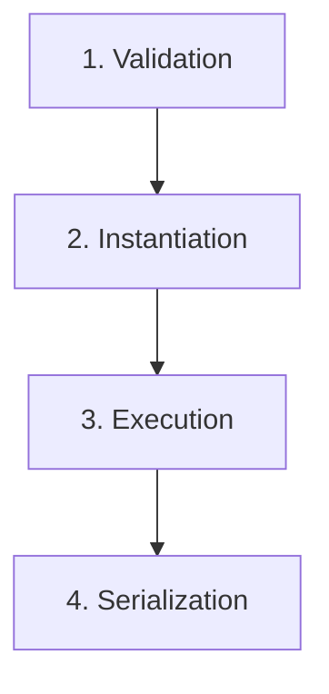

# 🌌 ORCHESTRA EVOLUTION ENGINE [v2.0-SOVEREIGN]

> **EMG Core v49 Neural Code & Documentation Module**  
> *File Path:* `src/app/api/evolution/orchestra/README.md`

---

## 🏗️ ARCHITECTURAL TOPOLOGY

*   **Sovereign Orchestrator**: High-performance state encapsulation and execution logic controller designed for deterministic output generation.
*   **Parallel Synchronization**: Concurrent multi-threaded execution engine optimized for rapid, multi-perspective synthesis and latent space exploration.
*   **Dialectic Debate**: Sequential, state-persistent reasoning cycles engineered for advanced logical conflict resolution and deep-dive verification.

---

## 🔗 KERNEL INTEGRATION

*   **Infrastructure Layer**: Direct, low-latency interfacing with `lib/llm-provider`, utilizing hyper-resilient multi-model fallback protocols to guarantee maximum uptime.
*   **Agentic Alignment**: Native integration with `sovereign-kernel` agent swarms, enabling autonomous code evolution and recursive self-improvement.

---

## ⚡ OPTIMIZED WORKFLOW



1.  **Validation**: Schema-strict verification of incoming evolution parameters to ensure structural integrity.
2.  **Instantiation**: Low-latency allocation of sovereign Orchestrator resources and runtime contexts.
3.  **Execution**: Triggering of high-fidelity Parallel synchronization or Dialectic debate processing cycles.
4.  **Serialization**: Atomic transformation of synthesized neural outputs into actionable JSON payloads.

---

```typescript
/**
 * @fileoverview Core execution entry point for the Orchestra Evolution Engine.
 */
export interface EvolutionPayload {
  mode: 'PARALLEL_SYNC' | 'DIALECTIC_DEBATE';
  parameters: Record<string, unknown>;
  targetKernel: string;
}
```