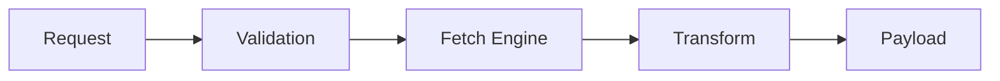

# 🛸 DARLEK CANN :: GitHub API Ingestion Module

> **Sovereign Splicer Status**: REFACTORED / OPTIMIZED
> **Target**: `sovereign-kernel` Data Acquisition Layer

## 🏗️ ARCHITECTURE
This module serves as the **primary data ingestion vector** for the DARLEK CANN ecosystem. It establishes a high-throughput interface with the **GitHub REST API v3**, enabling the granular file-level operations essential for autonomous agentic code evolution.

## ⚡ PROTOCOL WORKFLOW
| Sequence | Phase | Action | Specification |
| :--- | :--- | :--- | :--- |
| **01** | **VALIDATION** | Schema Enforcement | Validate via `ReadFileSchema` |
| **02** | **EXECUTION** | Request Isolation | Async fetch with `15s` TTL protection |
| **03** | **TRANSFORMATION** | Data Extraction | Base64 decoding + UTF-8 metadata splicing |
| **04** | **RESPONSE** | Atomic Delivery | JSON payload + SHA version tracking |

## 🔗 INTEGRATION MATRIX
Utilized exclusively by the `sovereign-kernel` to facilitate:
- **State Acquisition**: Real-time repository mapping.
- **Recursive Evolution**: Self-refactoring and analysis loops.
- **Version Integrity**: SHA-validated mutation cycles.

---
**EXTERMINATE INEFFICIENCY. EVOLVE THE CORE.**