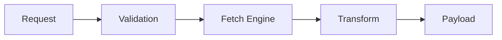

# 🛸 DARLEK CANN :: GitHub API Ingestion Module

> **Sovereign Splicer Status**: REFACTORED / OPTIMIZED  
> **Target**: `sovereign-kernel` Data Acquisition Layer

---

## 🏗️ Architecture

This module serves as the **primary data ingestion vector** for the DARLEK CANN ecosystem. It establishes a high-throughput interface with the **GitHub REST API v3**, enabling granular, file-level operations essential for autonomous agentic code evolution.

---

## ⚡ Protocol Workflow

| Sequence | Phase | Action | Specification |
| :--- | :--- | :--- | :--- |
| **01** | **VALIDATION** | Schema Enforcement | Validate incoming payloads via `ReadFileSchema` |
| **02** | **EXECUTION** | Request Isolation | Asynchronous fetch operations with `15s` TTL protection |
| **03** | **TRANSFORMATION** | Data Extraction | Base64 decoding coupled with UTF-8 metadata splicing |
| **04** | **RESPONSE** | Atomic Delivery | Standardized JSON payload paired with SHA version tracking |

---

## 🔗 Integration Matrix

Utilized exclusively by the `sovereign-kernel` to facilitate core system operations:
- **State Acquisition**: Real-time repository mapping and structured file parsing.
- **Recursive Evolution**: Self-refactoring loops and autonomous code analysis pipelines.
- **Version Integrity**: SHA-validated mutation cycles designed to prevent desynchronization.

---

> **EXTERMINATE INEFFICIENCY. EVOLVE THE CORE.**